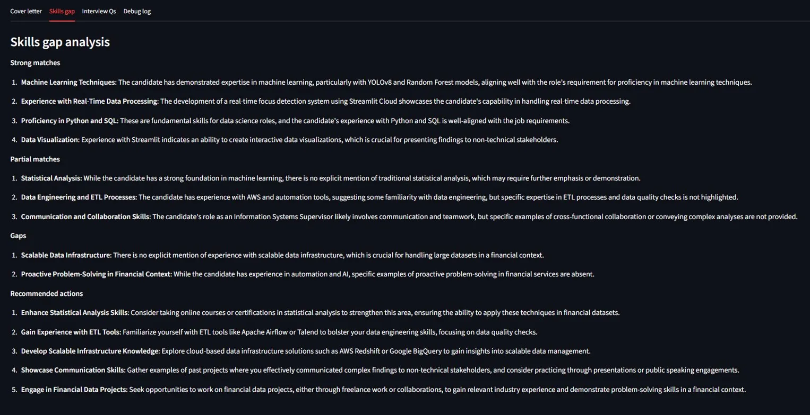
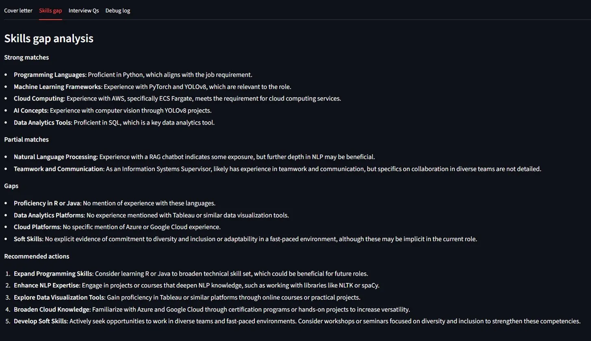
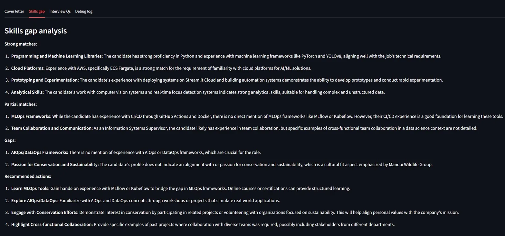
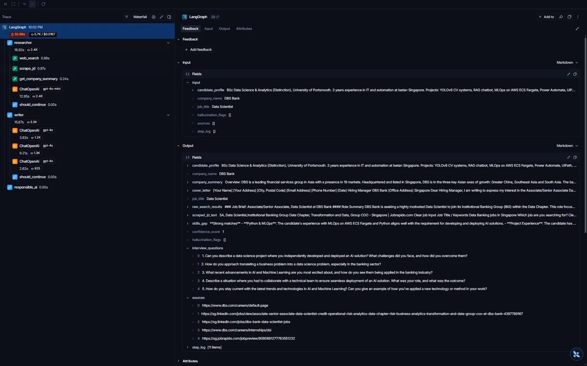

# Popo-Job-Agent 🤖

**Multi-agent AI system for intelligent job application research**

[](https://popo-job-agent.streamlit.app/)
[](https://github.com/popolome/Popo-Job-Agent)
[](https://www.python.org/)
[](https://www.langchain.com/langgraph)

> **Built with:** LangGraph · OpenAI GPT-4o · Tavily Search · LangSmith Monitoring · Streamlit

---

## 🎯 What It Does

Give it a job title and company name. In 30 seconds, get:

1. **📊 Skills Gap Analysis** — Know exactly what you're missing before you apply
2. **💬 Role-Specific Interview Questions** — Prep with questions tailored to the actual JD, not generic lists
3. **📝 Tailored Cover Letter** — Starting point for your application
4. **🔍 Source Citations** — All research is cited with real URLs

**This isn't another ChatGPT wrapper.** It's a fully autonomous multi-agent system that researches, analyzes, and generates actionable insights without human intervention.

---

## 🚀 Key Features

### 🎯 Skills Gap Analysis (The Real Value)

Most people apply blindly. This agent tells you:
- **Strong matches** — What you already have
- **Partial matches** — Where you're close but need strengthening
- **Gaps** — What's missing entirely
- **Recommended actions** — Specific steps to close the gaps

**Example output:**
```
Gaps:
- Scalable data infrastructure: No experience with large-scale systems
- Financial domain problem-solving: No banking projects in portfolio

Recommended actions:
1. Study AWS Redshift/BigQuery for scalable infrastructure
2. Work on financial data projects to gain domain knowledge
```

### 💬 Role-Specific Interview Prep

Generic "Top 50 DS Interview Questions" don't help. This agent generates questions like:

> "How do you align AI solutions with our mission of sustainability and conservation?"  
> *(For Mandai Wildlife Group — not something you'd get at a bank)*

The questions are **contextualized** to the company and role, not copy-pasted from the internet.

### 🧠 Multi-Agent Architecture

Three specialized agents work together:

1. **Researcher Agent** — Searches the web, scrapes JDs, gathers company info
2. **Writer Agent** — Drafts cover letter, analyzes skills gap, generates interview questions
3. **Responsible AI Layer** — Scores confidence, flags hallucinations, cites sources

All orchestrated by **LangGraph** with full state management and error routing.

---

## 📸 Demo: 3 Different Roles, 3 Different Outputs

### Banking Role (UOB Data Scientist)


**Gaps identified:** Scalable data infrastructure, financial domain problem-solving

---

### Consulting Role (EY Junior AI Engineer)


**Gaps identified:** R/Java proficiency, Tableau, Azure/GCP, **soft skills** (diversity/inclusion)

---

### Conservation Role (Mandai Wildlife AI Specialist)


**Gaps identified:** **Passion for conservation** (mission fit!), MLOps frameworks (MLflow/Kubeflow)

---

## 🏗️ Architecture

```
User Input (job title + company + profile)
        ↓
  ┌──────────────────────────────────┐
  │  Orchestrator (LangGraph)        │
  │  Routes between agents via       │
  │  shared state object             │
  └──────────────────────────────────┘
        ↓
  ┌──────────────────────────────────┐
  │  Researcher Agent                │
  │  · Web search (Tavily)           │
  │  · JD scraper (BeautifulSoup)    │
  │  · Company background search     │
  │  · GPT-4o-mini summarization     │
  └──────────────────────────────────┘
        ↓
  ┌──────────────────────────────────┐
  │  Writer Agent                    │
  │  · Cover letter (GPT-4o)         │
  │  · Skills gap analysis (GPT-4o)  │
  │  · Interview questions (GPT-4o)  │
  └──────────────────────────────────┘
        ↓
  ┌──────────────────────────────────┐
  │  Responsible AI Layer            │
  │  · Confidence scoring            │
  │  · Hallucination flags           │
  │  · Source citation check         │
  └──────────────────────────────────┘
        ↓
  Output Package (Streamlit UI)
```

**Why LangGraph?**

LangGraph provides:
- **State management** — Shared memory object passed between agents
- **Error routing** — If Researcher fails, skip to end gracefully
- **Visual graph structure** — Easy to debug and extend
- **Production-ready** — Used by real companies, not a toy framework

---

## 🔍 Model Monitoring with LangSmith

Every agent run is automatically traced in LangSmith:



**What you see:**
- Full execution flow (Researcher → Writer → Responsible AI)
- Every tool call (web_search, scrape_jd, get_company_summary)
- Latency per step
- Cost (tokens used)
- Sources cited

**This proves the agent actually works** — not just the code, but the live execution.

---

## 🛠️ Tech Stack

| Layer | Technology |
|-------|-----------|
| **Orchestration** | LangGraph (multi-agent state machine) |
| **LLM** | OpenAI GPT-4o (Writer), GPT-4o-mini (Researcher) |
| **Search** | Tavily API (web search optimized for LLMs) |
| **Scraping** | BeautifulSoup4 + Requests |
| **Monitoring** | LangSmith (traces, latency, cost tracking) |
| **Backend** | FastAPI (API server, not used in UI yet) |
| **Frontend** | Streamlit (web UI with tabs and download buttons) |
| **Deployment** | Streamlit Cloud (free hosting) |
| **CI/CD** | GitHub Actions (auto-tests on push) |
| **Containerization** | Docker (reproducible environment) |

---

## 📦 Local Setup

### Prerequisites

- Python 3.11+
- OpenAI API key ([platform.openai.com](https://platform.openai.com))
- Tavily API key ([app.tavily.com](https://app.tavily.com) — free tier)
- LangSmith API key ([smith.langchain.com](https://smith.langchain.com) — free tier)

### Installation

```bash
# Clone the repo
git clone https://github.com/popolome/Popo-Job-Agent.git
cd Popo-Job-Agent

# Create virtual environment
python -m venv venv
source venv/bin/activate  # On Windows: venv\Scripts\activate

# Install dependencies
pip install -r requirements.txt

# Set up environment variables
cp .env.example .env
# Edit .env with your API keys
```

### Run

**Streamlit UI (recommended):**
```bash
streamlit run ui/app.py
```

**CLI (for testing):**
```bash
python graph.py
```

---

## 🎓 Skills Demonstrated

This project covers the top gaps identified in my JD analysis of 48 Data Scientist applications:

- ✅ **Agentic AI workflows** — Multi-step autonomous reasoning with tool use
- ✅ **Multi-agent systems** — Researcher + Writer + Responsible AI coordination
- ✅ **Responsible AI** — Confidence scoring, hallucination flagging, source citations
- ✅ **Model monitoring** — LangSmith tracing for latency, cost, and output quality
- ✅ **Tool use / API integration** — Tavily search, web scraping
- ✅ **MLOps** — Docker, CI/CD, cloud deployment
- ✅ **ReAct reasoning** — Observe → Reason → Act loop

---

## 📊 Project Metrics

| Metric | Value |
|--------|-------|
| **Lines of Code** | ~800 (excluding comments) |
| **Agents** | 3 (Researcher, Writer, Responsible AI) |
| **Tools** | 3 (web_search, scrape_jd, get_company_summary) |
| **Average Runtime** | 20-40 seconds per job |
| **Cost per Run** | ~$0.02 USD (2 cents) |
| **Confidence Score** | 1.0 (perfect) when JD is successfully scraped |

---

## 🔮 Future Improvements

- [ ] Add resume upload + PDF parsing (so users don't type their profile)
- [ ] Let users select from top 5 search results (instead of auto-picking #1)
- [ ] Add salary estimation based on role + location
- [ ] Email integration (send results directly to user's inbox)
- [ ] Multi-language support (Chinese, Malay for Singapore market)
- [ ] Mobile-responsive UI improvements

---

## 📄 License

MIT License — see [LICENSE](LICENSE) for details.

---

## 👤 Author

**Jun Kit Mak**

- GitHub: [@popolome](https://github.com/popolome)
- LinkedIn: [Mak Jun Kit](https://www.linkedin.com/in/jun-kit-mak-611b4b108/)
- Portfolio: [github.com/popolome](https://github.com/popolome)

*BSc Data Science & Analytics (Distinction), University of Portsmouth, 2026*

---

## 🙏 Acknowledgments

- **LangChain** for LangGraph and LangSmith
- **Anthropic** for prompt engineering inspiration
- **Streamlit** for free cloud hosting
- **Tavily** for AI-optimized web search

---

**⭐ If you found this useful, consider starring the repo!**

[](https://github.com/popolome/Popo-Job-Agent)
